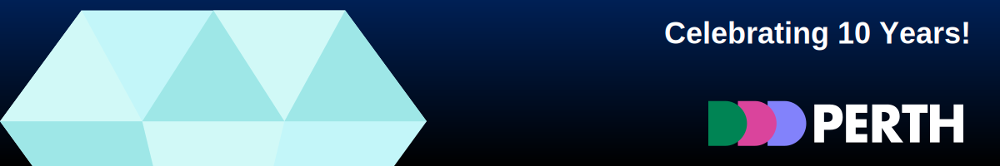

	</img>

  Show your support:
   
  
  &nbsp;&nbsp;
  

<!--Main-Section-->
 

  &nbsp;&nbsp;
  
  &nbsp;&nbsp;
  
  &nbsp;&nbsp;
  	

Full-stack developer with a passion for crafting end-to-end solutions. 
I love turning complex problems into simple, elegant code  whether it's front-end design or back-end architecture. 
Always exploring the latest in tech to build innovative, scalable projects.
  
Let’s create something awesome together!

 

<!--img src="./assets/svg/break.svg" alt="Decorated page break." width=1000px hight=10px min-width="200%" align="left"-->
 

	<h2 align='left'>My Stack</h2>
 

	 <h4 align='right'>Languages</h4>
  
<samp>Languages</samp>

  	

		 
		 
		 
		 
		 
		 
		 
		 
		 
	 	
	 	
	 	
		 
	 	
		 
	 	
	 

 

 

  <h4 align="right">Back-End</h4>
  
<samp>Back-End</samp>

	

		
		
		
		
		
		
	

 

 

	<h4 align="right">Frameworks & Libraries</h4>
  
<samp>Framework & Libraries</samp>

 	

		
		
		
		
		
		
		
		
		
		
		
		
		
		
		
		
		
		
		
		
		
		
		
		
		
		
		
		
		
		
		
		
		
		
	

 

 

   <h4 align="right">Art & Design</h4>
  
<samp>Art & Design</samp>

	

		
		
		
		
		
		
	

 

 

 
<h2 align='right'>Github Statistics</h2>
<table>
  <tr>
    <td>
      
  	  
	  </td>
  </tr>
</table>
 

 

  <h2>Recent Events</h2>
	<h3 align="right"><samp>November 2024</samp></h3>
  <blockquote>
  <!--November 2024-->
    <table style="table-layout: fixed;">
	  <tr>
	    <th><h4 align="center">Google DevFest 2024</h4></th>
	  </tr>
	  <tr>
	    <td>
		  
		</td>
      </tr>
	  <tr>
	    <td>
		  

		    
About Event

			<blockquote>
			  
Attended Google DevFest '24 in Perth, Western Australia.
			    
			  A one-day conference organised annually by the Google Developer Group (GDG) Perth, focused on community building and exploring Google's latest technologies.
			   
			  <h4>Key-Topics</h4>
			  <ul>
			    <li>In-depth sessions on AI</li>
			  	<li>Web Development with Google technologies</li>
					<li>The latest cloud-based innovations</li>
			  </ul>
			  Find out <a href="https://gdg.community.dev/events/details/google-gdg-perth-presents-devfest-perth-ai-web-cloud-amp-navigating-your-career/">more</a> about this event.
			  

			</blockquote>
		  

		</td>
	  </tr>
	</table>
	

		
		
		
		
		
	

	 
    <table style="table-layout: fixed;">
	  <tr>
	    <th><h4 align="center">DDD Perth 2024</h4></th>
	  </tr>
	  <tr>
	    <td>
		  
		</td>
      </tr>
	  <tr>
	    <td>
		  

		    
About Event

			<blockquote>
			  
Attended the 10th Anniversary of <a href="https://dddperth.com">DDD Perth</a>.
			    
			  DDD Perth 2024 marked a significant milestone as the conference celebrated its 10th anniversary, bringing Perth's largest community-run tech conference back to <a href="https://optusstadium.com.au">Optus Stadium</a> on Saturday, November 16th, 2024
			   
			  <h4>Keynote Speaker</h4>
			  

			    This years keynote speaker was <a href="https://www.linkedin.com/in/katjasrz/">Ekaterina Sirazitdinova</a>, a Senior Deep Learning Scientist at <a href="https://www.nvidia.com">NVIDIA</a>. Ekaterina delivered an amazing talk about the latest advances in multimodal generative AI, explaining the inner workings of their systems whilst exploring key concepts and techniques involved. This was a personal highlight of the day for me, with this being to debut appearance in Australia all the way from Munich, Germany, it was a great honour to connect with her and learn from one of the best minds advancing AI.
			  

			  <h4>Other Highlights</h4>
			  

			  	Given the size of the event, there were definetly some clashes between talks that I wanted to see, which ment I had to make some tough choices on who to see. However that being said, here are some other personal highlights from the talks I was able to see:
				<ul>
				  <li><b>Neuroscience Meets Cybersecurity</b>: Enhancing IT Operations Through Brain Science Presented by: <a href="https://www.linkedin.com/in/vannessavanbeek/">Vannessa Van Beek</a></li>
				  <li><b>Containerized Developer Environments</b>: Helping Devs help Charities Presented by: <a href="https://www.linkedin.com/in/dylancto/">Dylan To</a> and <a href="https://www.linkedin.com/in/frinze-erin-lapuz/">Frinze Lapuz</a></li>
				  <li><b>Overcoming Your Imposter Syndrome with GitHub Copilot</b> Presented by: <a href="">Michelle Sandford</a></li>
				</ul>
			  

			  Find out <a href="https://dddperth.com">more</a> about this event.
			  

			</blockquote>
		  

		</td>
	  </tr>
	</table>
  </blockquote>
	 
  <!--October 2024-->
	<h3 align='right'><samp>October 2024<samp></h3>
  <blockquote>
		<table style="table-layout: fixed;">
			<tr>
				<th><h4 align='center'>GitHub Universe 2024<samp>(virtual attendance)</samp></h4></th>
			</tr>
			<tr>
				<td align='center'>
					
				</td>
			</tr>
			<tr>
				<td>
				

					
About Event

					<blockquote>
						

							Attended the 10 year anniversary of <a href="https://reg.githubuniverse.com/flow/github/universe24/attendee-portal/page/speakers">GitHub Universe</a> virtually.
						

					</blockquote>
				

				</td>
			</tr>
		</table>
		

			
			
			
			
			
		

		 
    <table style="table-layout: fixed;" width:100%>
      <tr>
	    <th width=1000vw><h4 align='center'>ViteConf 2024<samp>(virtual attendance)</samp></h4>
	  </tr>
	  <tr>
        <td align='center'>
					
        </td>
	  </tr>
	  <tr>
        <td>
          

            

              About Event
            

			<blockquote>
              
Virtually participated in workshops and attended presentations at <a href='https://viteconf.org/'>ViteConf 2024</a>.
			    
			  ViteConf is 24 hr online event for web developers where you can engage and learn from some of the leaders innovating the Vite Ecosystem, through talks and host interactive workshops.
			    
			  2024 marked the 3rd year of ViteConf and consisted of 45 presentations representing some of the biggest names in web tech 
			  including: 
			  

			  <table style="table-layout: fixed;">
			    <tr>
				  <th></th>
				</tr>
				<tr>
			      <td>
			        
			      </td>
			      <td>
			          
			      </td>
			      <td>
			          
			      </td>
			      <td>
			          
			      </td>
			      <td>
			          
			      </td>
			    </tr>
			    <tr>
		          <td>
			        <h4><a href="https://astro.build/">Astro</a></h4>
			      </td>
			      <td>
				    <h4><a href="https://react.dev/">React</a></h4>
				  </td>
			      <td>
				    <h4><a href="https://vuejs.org/">VueJS</a></h4>
				  </td>
			      <td>
				    <h4><a href="https://angular.dev/">Angular</a></h4>
				  </td>
			      <td>
				    <h4><a href="https://nodejs.org/en">NodeJS</a></h4>
				  </td>
			    </tr>
			    <tr>
			      <td>
			          
			      </td>
			      <td>
			          
			      </td>
			      <td>
			          
			      </td>
			      <td>
			          
			      </td>
			      <td>
			          
			      </td>
			    </tr>
			    <tr>
			      <td>
				<h4><a href="https://www.google.com/intl/en_au/chrome/">Google Chrome</a></h4>
			      </td>
			      <td>
				    <h4><a href="https://azure.microsoft.com/en-ca">Microsoft Azure</a></h4>
				  </td>
			      <td>
				    <h4><a href="https://www.ruby-lang.org/en/">Ruby</a></h4>
				  </td>
			      <td>
				    <h4><a href="https://laravel.com/">Laravel</a></h4>
				  </td>
			      <td>
				    <h4><a href="https://nuxt.com/">Nuxt</a></h4>
				  </td>
			    </tr>
			    <tr>
			      <td>
			          
			      </td>
			      <td>
			          
			      </td>
			      <td>
			          
			      </td>
			      <td>
			          
			      </td>
			      <td>
			        
			      </td>
			    </tr>
			    <tr>
			      <td>
				    <h4><a href="https://svelte.dev/">Svelte</a></h4>
				  </td>
			      <td>
				    <h4><a href="https://www.solidjs.com/">SolidJS</a></h4>
				  </td>
			      <td>
				    <h4><a href="https://voidzero.dev/">Void(0)</a></h4>
				  </td>
			      <td>
				    <h4><a href="https://volarjs.dev/">VolaJS</a></h4>
				  </td>
			      <td>
				    <h4><a href="https://remix.run/">Remix</a></h4>
			      </td>
			    </tr>
			    <tr>
			      <td>
			          
			      </td>
			      <td>
			        
			      </td>
			      <td>
			        
			      </td>
			      <td>
  			        
			      </td>
			      <td>
			        
			      </td>
			    </tr>
			    <tr>
			      <td>
				    <h4><a href="https://www.shopify.com/au">Shopify</a></h4>
				  </td>
			      <td>
				    <h4><a href="https://vitest.dev/">Vitest</a></h4>
				  </td>
			      <td>
				    <h4><a href="https://unjs.io/">UnJS</a></h4>
				  </td>
			      <td>
				    <h4><a href="https://vitepress.dev/">VitePress</a></h4>
				  </td>
			      <td>
				    <h4><a href="https://oxc.rs/">OXC</a></h4>
			     </td>
			  	</tr>
		      </table>
			  
And many more!
			    
			  A full list of speakers can be found <a href="https://viteconf.org/24/speakers">here</a>.
		    </blockquote>
          

        </td>
      </tr>
    </table>
  </blockquote>
	 
  <!--September 2024-->
	<h3 align="right"><samp>September 2024</samp></h3>
  <blockquote>
    <table style="table-layout: fixed;">
	  <tr>
	    <th colspan=2 width=1000vw><h4 align='center'>National Missing Persons Hackathon 2024</h4></th>
	  </tr>
      <tr>
        <td width=30% align='center'>
		  
		</td>
    <td align='center'>
	    
Participant in the National Missing Persons Hackathon 2024.  <b>Ranking 7th Place.</b>
		  

		</td>
	  </tr>
	  <tr>
	  	<td colspan=2>
		  

		    
About Event

				<blockquote>
					

						The <b>National Missing Persons Hackathon</b> is a non-theoretical capture the flag (CTP) competition where participants source intelligence and potentials leads on real missing person cases during a 6 hour event.
						 <be>
						Participants are awarded points based on the number of submissions, which could include recent photos, last know locations, social media accounts, etc.
						 <be>
						This year my team <samp>(consisting of 2 members)</samp> <b>placed 7th</b> against <b>212</b> other teams. We were also able to source recent information indicating the whereabouts of a person who had been evading police for roughly 10 years.
						 <be>
						For more information, check out the <a href="https://www.missingpersonshackathon.com.au/">official NMPH website.</a>
					

				</blockquote>
		  

        </td>
      </tr>
    </table>
  </blockquote>
   
  
  <blockquote>
    <h3 allign='center'>Trophies</h3>
    
  </blockquote>
   
  
   
  <blockquote>
    <h3 align='center'>Activity</h3>
	
  </blockquote>

